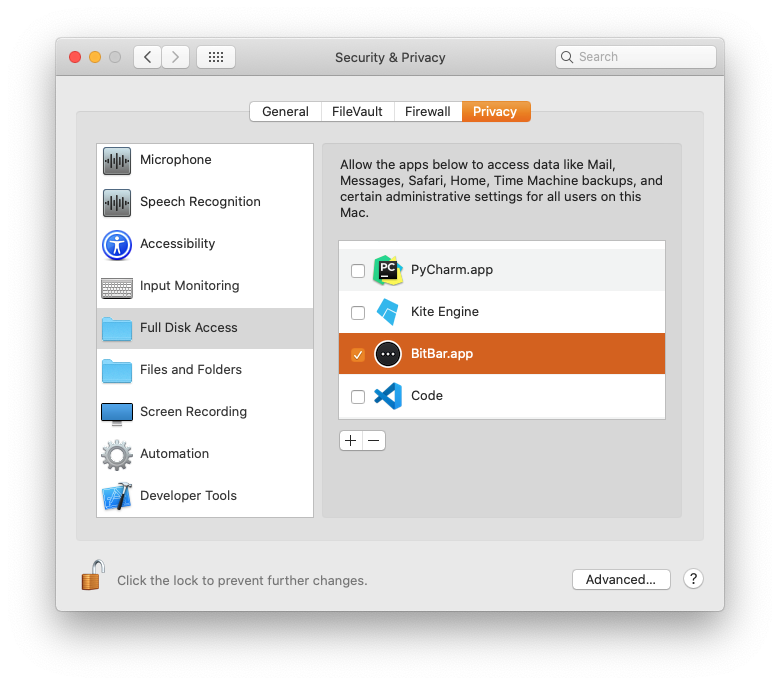

# Time Machine Progress

BitBar Plugin which shows the progress of Time Machine backups visually.

## Requirements

- [BitBar](https://getbitbar.com)
- [filesize](https://rubygems.org/gems/filesize/)
  `gem install filesize`
- macOS 10.14.2
  (other versions might work but are untested)
- Full Disk Access (see below)

## Fix `Error Reading File: /Library/Preferences/com.apple.TimeMachine.plist`

Time Machine Progress needs to read the contents of `/Library/Preferences/com.apple.TimeMachine.plist` to display the time of the last backup. Since macOS 10.14 (Mojave), this file is under System Integrity Protection (SIP) and cannot be read unless we grant BitBar Full Disk Access from the **System Preferences → Security & Privacy → Privacy → Full Disk Access** menu.

## Acknowledgments

The plugin is based on the [Show Time machine Progress](https://getbitbar.com/plugins/System/timemachine.2m.rb) plugin by Slamet Kristanto.
